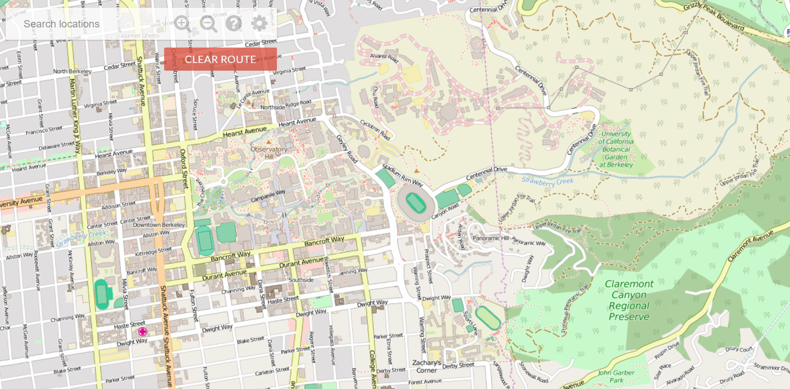
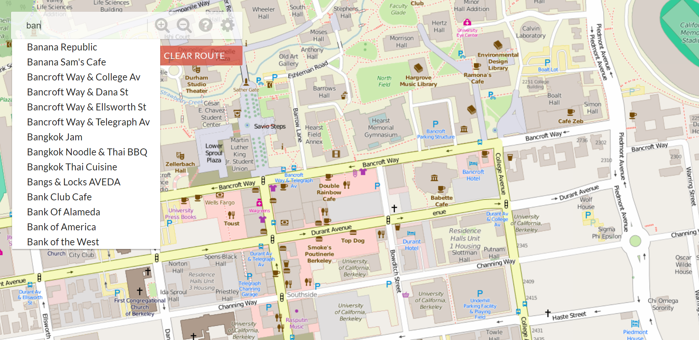

# BearMaps

This project designs and implements the backend of a web mapping application of Berkeley (like Google Maps). It handles searching locations, displaying map, zooming in/out, finding shortest path between 2 locations (A* search). Image files come from the OpenStreetMap dataset. The project is implemented through Java and Apache Maven, deployed on Heroku. 

The project spec is at https://sp18.datastructur.es/materials/proj/proj3/proj3

##Home Page

##Finding shortest path between two locations

##Query Autocomplete

